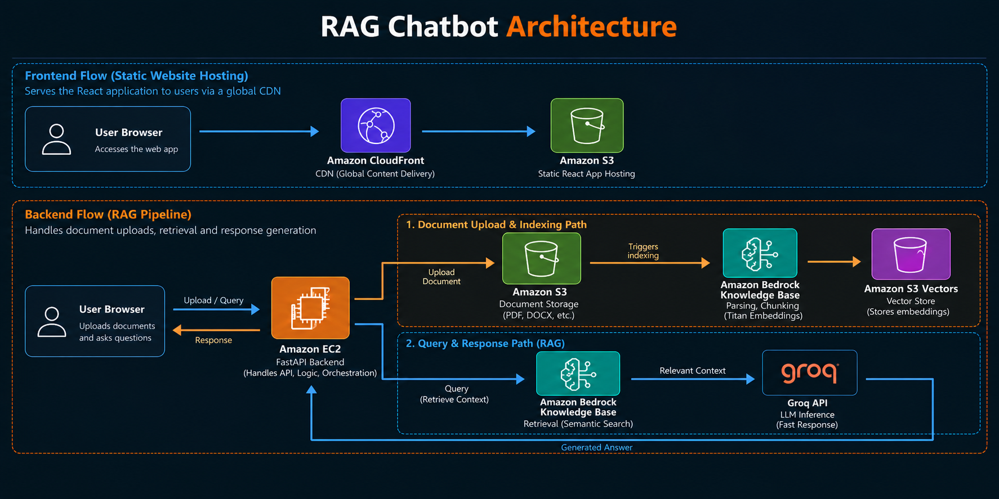

# GenAI RAG Agent — AWS Bedrock + LangChain + FastAPI

An AI-powered chatbot that answers questions grounded in your own documents, using Retrieval-Augmented Generation (RAG) on AWS. Upload up to 5 documents, ask questions, and get answers sourced directly from that content and not from the model's general training data.

> 🚀 **Live Demo:** [**Watch Walkthrough Video on YouTube ▶**](https://youtu.be/zuvj-i0scgM)

---

## Architecture



---

## How It Works

### 1. Document Ingestion & Indexing Pipeline
1. **Upload:** User uploads documents (PDF, DOCX, TXT) via the UI → stored in **Amazon S3**.
2. **Ingestion Trigger:** FastAPI calls Bedrock's `start_ingestion_job` API to initiate synchronization.
3. **Parsing & Chunking:** Bedrock splits documents into semantic chunks.
4. **Vector Embedding:** Chunks are embedded via **Amazon Titan Text Embeddings**.
5. **Vector Storage:** Vectors are stored in **Amazon S3 Vectors** (pay-per-use, zero idle cost floor).

### 2. Query & Retrieval Pipeline (ReAct Agent)
1. **User Query:** User submits a prompt (with full multi-turn conversation history).
2. **Reasoning Loop:** LangChain's `create_react_agent` evaluates the query and decides when retrieval is required.
3. **Semantic Retrieval:** `AmazonKnowledgeBasesRetriever` fetches the most relevant chunks from the Knowledge Base.
4. **Inference:** Chunks and prompt context are passed to **Groq** for sub-second LLM inference.
5. **Delivery:** The grounded answer is returned directly to the chat interface.

### 3. State & Conversation Memory
- **Multi-Turn Context:** Full conversation history is sent with each turn so follow-up queries (*"Can you summarize that?"*) resolve naturally without repeating context.
- **Full Lifecycle Sync:** Document uploads, deletions, and knowledge base sync states are tracked live in the UI.

---

## AWS Services Used & Why

| Service | Role | Why this choice |
|---|---|---|
| **Amazon Bedrock Knowledge Base** | Managed RAG pipeline — parsing, chunking, embedding | Avoids building a custom ingestion pipeline from scratch; reliable, AWS-managed |
| **Amazon S3 Vectors** | Vector store for embeddings | Pay-per-use, no idle billing floor — a deliberate cost tradeoff over OpenSearch Serverless, which has a persistent hourly minimum even at zero traffic |
| **Amazon S3** | Document + static frontend storage | Standard, durable, cost-effective object storage for both source documents and the built React web app |
| **Amazon CloudFront** | CDN & reverse proxy | Fast global delivery and HTTPS termination for the frontend, with path-based behaviors routing API calls seamlessly |
| **Amazon EC2** | Hosts the FastAPI backend | Chosen over Lambda after hitting Linux/Windows binary incompatibility issues with compiled Python dependencies (`pydantic-core`) in a serverless packaging attempt; EC2 avoids this entirely by installing dependencies natively on Linux, and avoids Lambda cold-start latency for multi-step RAG requests |
| **IAM** | Scoped permissions for Bedrock, S3, and S3 Vectors | Used a dedicated IAM user (not root), with custom inline policies where AWS managed policies didn't cover newer service namespaces |
| **Groq** | LLM inference | Ultra-low latency inference with reliable tool/function-calling support — a deliberate cost optimization over Bedrock-hosted models for this stage of the project |

---

## Tech Stack

- **Backend:** FastAPI, LangChain, LangGraph (`create_react_agent`), Uvicorn
- **LLM:** Groq (Llama 3 / OpenAI-compatible OSS models)
- **Retrieval:** `langchain-aws` (`AmazonKnowledgeBasesRetriever`)
- **Frontend:** React, Vite
- **Infra & Cloud:** AWS Bedrock, S3, S3 Vectors, EC2, CloudFront, IAM

---

## Features

- **Document Upload:** Support for up to 5 documents (PDF, DOCX, TXT, MD, RTF)
- **Live Sync Tracking:** Real-time sync status tracking (ingesting vs. synced) directly in the UI
- **One-Click Reset:** "Remove All" clears documents from both S3 and the Knowledge Base index
- **Multi-Turn Chat:** Context-aware conversation history with conversational memory
- **Cost-Optimized Architecture:** Zero idle vector database costs and on-demand compute

---

## Project Structure

```
├── agent.py               # LangChain ReAct agent & Bedrock retriever tool
├── server.py              # FastAPI endpoints (/chat, /upload, /documents, /sync-status)
├── requirements.txt       # Python backend dependencies
├── assets/
│   └── architecture.png   # Architecture diagram
└── frontend/              # React + Vite frontend
    ├── src/
    │   ├── App.jsx        # Main chat and document management UI
    │   └── main.jsx
    └── package.json
```

---

## Environment Variables

Create a `.env` file in the root directory:

```env
GROQ_API_KEY=your_groq_api_key
AWS_ACCESS_KEY_ID=your_aws_access_key
AWS_SECRET_ACCESS_KEY=your_aws_secret_key
AWS_DEFAULT_REGION=ap-south-1
KNOWLEDGE_BASE_ID=your_bedrock_kb_id
DATA_SOURCE_ID=your_bedrock_data_source_id
S3_BUCKET_NAME=your_document_bucket_name
```

---

## Cost-Conscious Design

This project was built with a personal-project portfolio budget. Key decisions made specifically to eliminate unexpected cloud bills:
- **S3 Vectors over OpenSearch Serverless:** Saves ~$350/month in OpenSearch compute units (OCUs) idle minimums.
- **Groq for inference:** Free/near-zero cost inference with sub-second token generation.
- **On-Demand EC2:** Instance runs when demoing and can be stopped when idle without losing configuration.

---

## Future Scope

- Migrate backend packaging to Docker containers on AWS ECS/Fargate or containerized Lambda for automated scaling.
- Add user authentication (AWS Cognito) for multi-tenant document isolation.
- Hybrid search (keyword + semantic) evaluation as document count scales.
